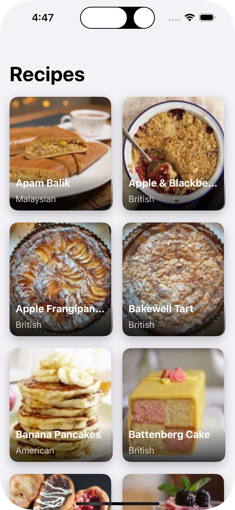
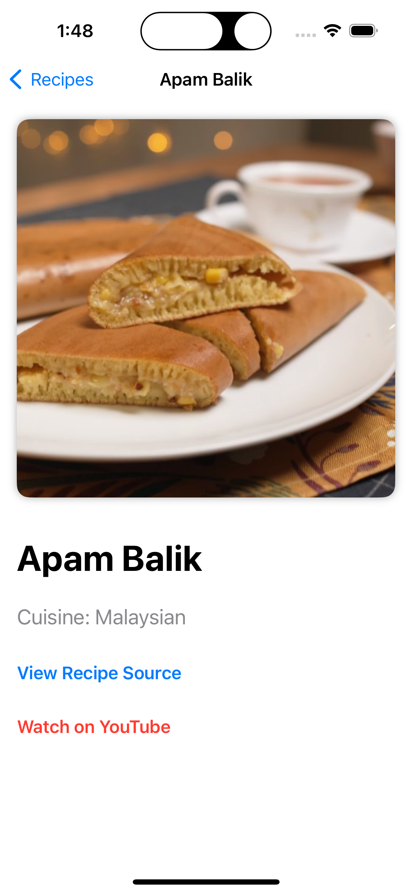
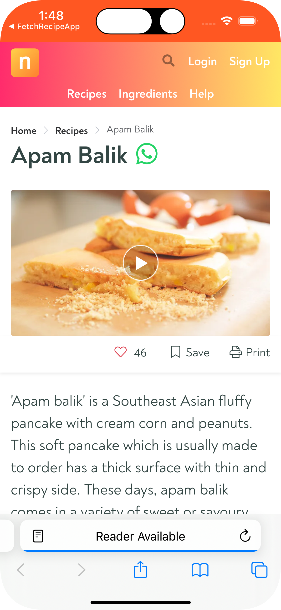
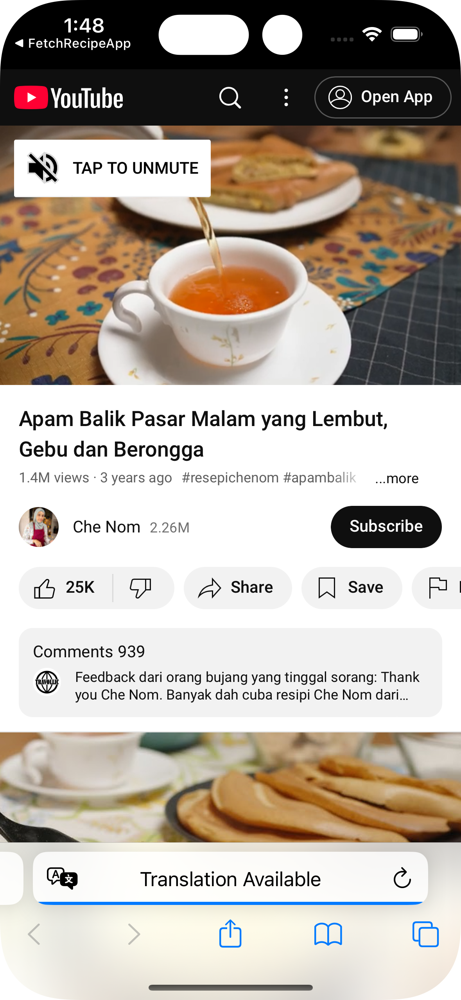
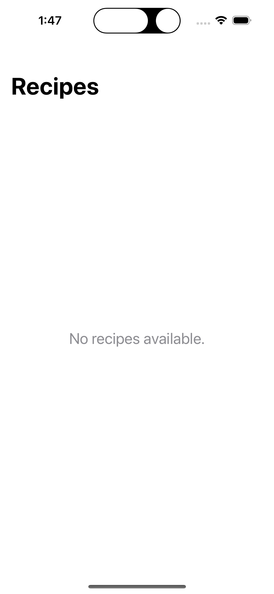
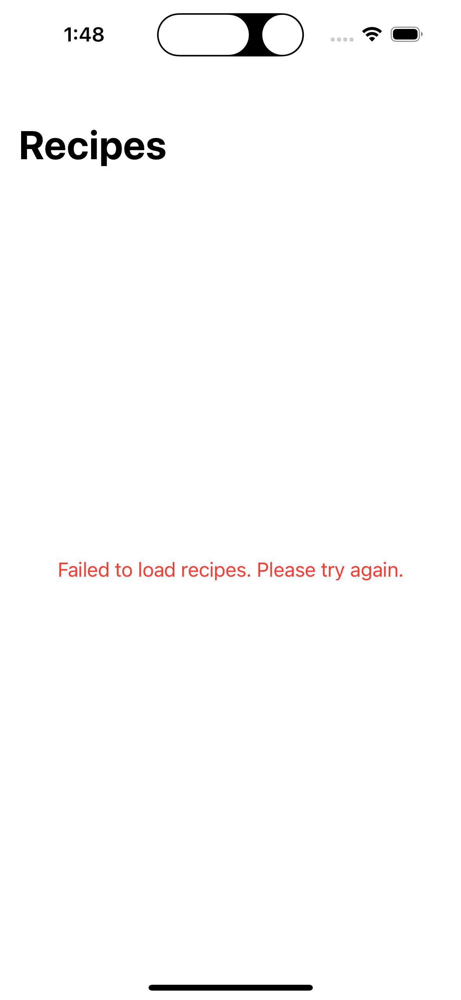

# takehomeproject-swiftui

# FetchRecipeApp

## Overview

`FetchRecipeApp` is a SwiftUI app that displays a list of recipes fetched from an API. Users can view basic recipe details like name, cuisine, and a small photo, and access detailed information including a large photo, source URL, and YouTube URL.

## Features
- **Recipe List**: Shows recipe name, cuisine, and small photo.
- **Recipe Detail**: Displays full details including large photo, source URL, and YouTube URL.
- **Error Handling**: Manages network and data errors.
- **Async Data Loading**: Uses Swift’s `async/await` for network requests.

## Architecture
- **MVVM**: Model-View-ViewModel pattern for clean separation of concerns.
- **SwiftUI**: Declarative UI framework for building the interface.
- **Async/Await**: For handling asynchronous network operations.

## Time Spent
- **Total**: 4 hours
  - Setup and API understanding: 0.5 hours
  - Building views: 2 hour
  - Error handling and testing: 1 hour
  - Final cleanup: 0.5 hours
  
## Unit Testing
Unit tests are written using the XCTest framework to ensure that core components of the app work as expected. The following views and logic are covered in the unit tests:
- **RecipeService**: Tests to verify that network requests correctly fetch data and handle errors.
- **RecipeListViewModel**: Tests to confirm that the ViewModel correctly updates the UI and handles data correctly.
- **RecipeListView**: Ensures correct display of recipe data, empty state handling, and error messages on failure.
- **RecipeDetailView**: Confirms display of recipe details, UI updates, and error handling when fetching fails.

## Design Decisions
- **No Third-Party Libraries**: The app is lightweight with no external dependencies.
- **Basic Error Handling**: Limited to network and data errors.
- **No Advanced Caching**: Images are loaded lazily without caching.

## Future Enhancements
- **Image Caching**: Implement caching to optimize image loading.
- **Offline Support**: Allow offline mode by storing data locally.
- **Testing**: Expand with UI and integration tests.

## Installation
1. Clone the repository:
    ```bash
    git clone https://github.com/SreytouchLang/FetchRecipeApp
    ```
2. Open in Xcode and run on a simulator or device.


## App Screenshots
<div style="display: flex; flex-direction: 'row';">
  
  
  
  
  
  
</div>
